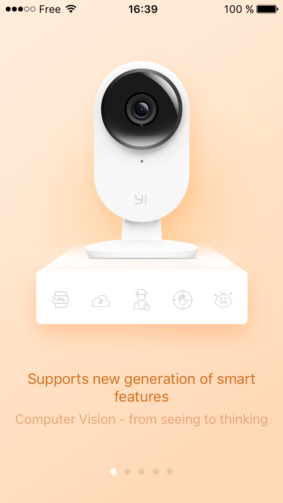
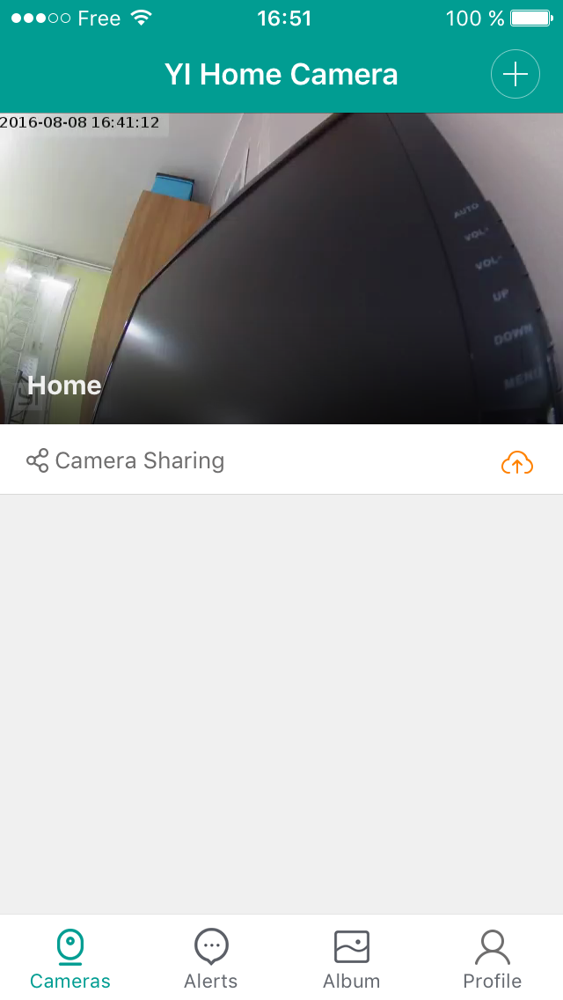

# YI Home - iOS

As of today, there is no international version of YI Camera V2, and the Chinese version is only supported on Android (multilingual) and iOS (Chinese only) on Chinese App Store.

Unfortunately, the YI Home Chinese application only provides Chinese language, that's why, even if you switch to Chinese App Store to install it and go back to English or French App Store, the app still remains in Chinese.

The aim of this project is to provide other languages to the Chinese application on iOS.

An iOS application is protected against modifications, but with some manipulations, we can achieve our goals !

When we modify something in the application, we need to resign it. But to be able to sign the application, the binary must be unencrypted. 

Apple claims that an application can't be decrypted, but fortunately, this is not totally true.

Thanks to jailbreak and [Clutch](https://github.com/KJCracks/Clutch), we can get the unencrypted binary of an application.

Since my iPhone 5s is under iOS 9.3.2 and doesn't support jailbreak, I bought an old iPhone 4 under iOS 7.1.2. It supports jailbreak, and lets me retrieve the unencrypted binary of the Chinese application. Since Clutch can only decrypt an application while running, I can only get the armv7 binary. This binary works also on newer devices, but as soon as Apple drops armv7 support from new devices, it may not work anymore.

As soon as we have the unencrypted binary, we can add international language support. Even if the international application doesn't support YI Camera V2, it includes all the required translation files and we can add them to the Chinese application. We can so add following languages:
* German (de.lproj)
* English (en.lproj)
* Spanish (es.lproj)
* French (fr.lproj)
* Italian (it.lproj)
* Korean (ko.lproj)
* Traditional Chinese (zh-Hant.lproj)

Since the French translation is neither full nor totally correct, I personnaly remove it from package to use English on my French device.

The last step consists in resigning the application. I own a developer certificate but don't want to use it for such hack. Apple now supports free certificate for testing, and I succeeded in resigning the application with such certificate.

Unfortunately, this signature process must be done for each device, and so you will have to own a real Mac (or a Hackintosh) with XCode to do it on your side.

Please look at following tutorial to setup a correct certificate.

<video src="https://github.com/niclet/yi-home-ios/raw/master/Tutorial.mp4" controls width="100%">
[Tutorial](https://github.com/niclet/yi-home-ios/raw/master/Tutorial.mp4)
</video>

(Update: you need to run this little project on your device to make sure it will accept the certificate)

Pay attention to the bundle identifier you choose in the project options, this parameter will be required to resign the application.

Now, open Terminal, go inside this repository clone, and run:

	./Resign.sh <BundleIdentifier>
	
Where &lt;BundleIdentifier&gt; is the one you choose during XCode Project creation. In my case, I run:

	./Resign.sh com.niclet.yihome

Finally, you can push the newly signed application to your device from XCode/Devices management tool.

Please note that on iOS 9 and above, you may have to accept the new certificate on your device from Settings/General/Profiles

Unfortunately, such certificates are expiring after 7 days, so you will have to do all these steps once a week, unless you buy a real developer certificate.

Update 2016-09-18 : generated IPA still works with iPhone 7, iOS 10.0.1, Xcode 8

 

    